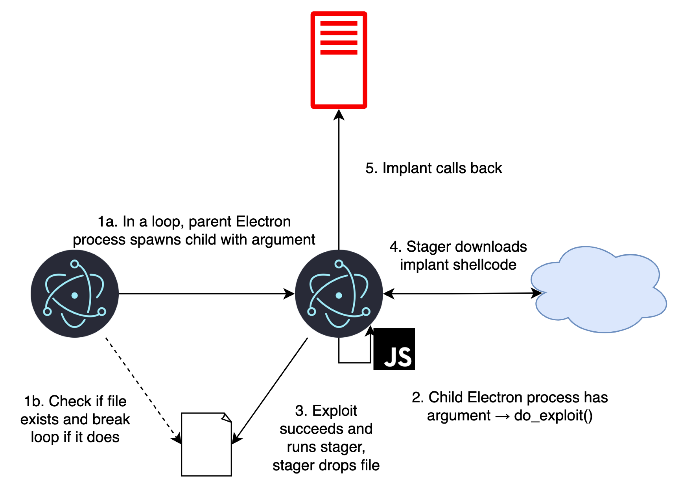

# 🛠️ Vulnerabilities 1001: C-Family Vulnerabilities  

  
  
  
  

This repository contains structured notes, labs, research studies, secure coding playbooks, and the certificate of completion for the **“Vulnerabilities 1001: C-Family Software Implementation Vulnerabilities”** course by **OpenSecurityTraining2**.  

---

## 📚 Notes  

- 📝 [`01-introduction.md`](./notes/01-introduction.md) – Course intro & foundations  
- 📝 [`02-buffer-overflow.md`](./notes/02-buffer-overflow.md) – Stack buffer overflow concepts  
- 📝 [`03-format-string.md`](./notes/03-format-string.md) – Format string attacks  
- 📝 [`04-integer-overflow.md`](./notes/04-integer-overflow.md) – Integer overflow vulnerabilities  
- 📝 [`05-use-after-free.md`](./notes/05-use-after-free.md) – UAF & dangling pointers  
- 📝 [`06-heap-exploitation.md`](./notes/06-heap-exploitation.md) – Heap exploitation techniques  
- 📝 [`07-rop-jop.md`](./notes/07-rop-jop.md) – Return/Jump Oriented Programming  
- 📝 [`08-mitigations.md`](./notes/08-mitigations.md) – Modern exploit mitigations  
- 📝 [`09-case-studies.md`](./notes/09-case-studies.md) – Real-world cases  

---

## 🧪 Labs  

- 💻 [`lab-buffer-overflow.md`](./labs/lab-buffer-overflow.md) – Practical buffer overflow lab  
- 💻 [`lab-format-string.md`](./labs/lab-format-string.md) – Format string exploitation lab  
- 💻 [`lab-uaf.md`](./labs/lab-uaf.md) – Use-After-Free lab exercise  

---

## 📋 Playbooks  

- ✅ [`secure-coding.md`](./playbooks/secure-coding.md) – Secure coding guidelines  
- ✅ [`detection-response.md`](./playbooks/detection-response.md) – Detection & response guide  

---

## 🔬 Research  

- 📄 [`case-studies.md`](./research/case-studies.md) – Case studies of famous exploits  
- 📄 [`real-world-exploits.md`](./research/real-world-exploits.md) – Exploits in the wild  
- 📄 [`timeline.md`](./research/timeline.md) – Vulnerability exploitation timeline  

---

## 📖 Documentation  

- 📘 [`overview.md`](./docs/overview.md) – Course overview & objectives  
- 📘 [`syllabus.md`](./docs/syllabus.md) – Full syllabus  
- 📘 [`roadmap.md`](./docs/roadmap.md) – Learning roadmap  
- 📘 [`glossary.md`](./docs/glossary.md) – Terminology & definitions  
- 📘 [`references.md`](./docs/references.md) – References & resources  

---

## 📸 Screenshots  

| Section             | Screenshot |
|---------------------|------------|
| 📚 Course           |  |
| 💬 Discussions      |  |

---

## 📊 Diagrams  

-   
-   

---

## 📜 Certificate  

📄 [`Vulnerabilities 1001: C-Family Software Implementation Vulnerabilities`](./cert/Vulnerabilities%201001C-Family%20Software%20Implementation%20Vulnerabilities.png)  

---

## 🗣️ Personal Review  

The **Vulnerabilities 1001** course is a deep dive into how software bugs in C-family languages (C, C++, etc.) evolve into full-blown vulnerabilities.  
- ✅ Well-structured with both theory and labs.  
- ✅ Explains not only “how” an exploit works but also the **historical context** and **mitigation evolution**.  
- ✅ Practical labs make abstract concepts tangible.  
- ⚠️ Requires solid C programming background to fully follow.  

👉 Overall, this course is highly recommended for anyone serious about **binary exploitation and secure software development**.  

---

## ✍️ Author  

**Thành Danh** – Red Team Learner & Security Researcher  

- GitHub: [@ngvuthdanhh](https://github.com/ngvuthdanhh)  

- Email: ngvu.thdanh@gmail.com  

---

## 📄 License  

This project is licensed under the terms of the **MIT License**.  
See [`LICENSE`](./LICENSE) for full details.  

© 2025 ngvuthdanhh. All rights reserved.  
